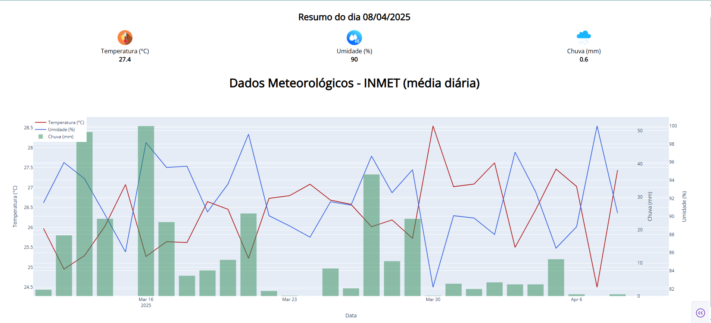

# 🌦️ INMET Weather Dashboard

Projeto completo de **coleta automatizada** e **visualização interativa** de dados meteorológicos da estação **BRAGANÇA (A226)** – INMET.

A essência deste projeto está na **automação inteligente da coleta de dados**, superando desafios como preenchimento dinâmico de formulários, manipulação de datas e download de arquivos CSV via navegador. Todo esse fluxo foi construído usando **Selenium**, com foco em **reprodutibilidade, personalização e independência de API**.

---

## 🔧 Destaques do Projeto

- 🧠 **Coleta automatizada com Selenium**: interage com o site oficial do INMET simulando ações humanas para preencher filtros (estado, estação e datas), gerar tabelas e baixar os dados em CSV.
- 🌍 **Personalização geográfica e temporal**: permite configurar facilmente o **estado**, a **estação meteorológica** e o **período de coleta**, adaptando a ferramenta a qualquer região do Brasil.
- 📊 **Visualização interativa com Dash**: apresenta as médias diárias de **temperatura** e **umidade**, além da **precipitação acumulada**, tudo com múltiplos eixos e visual moderno.
- 🧾 **Painel superior com resumo do último dia disponível**: mostra valores atualizados com ícones temáticos e destaque visual.

---

## 🛠️ Tecnologias Utilizadas

- `Python`
- `Selenium` (web scraping com manipulação de interface)
- `Pandas` (tratamento e agregação de dados)
- `Plotly Dash` (visualização interativa)
- `HTML/CSS` (estilização leve do dashboard)

---

## 🎯 Objetivo

Demonstrar um pipeline completo de **coleta, processamento e visualização de dados climáticos** com foco em:

- **Automação robusta**
- **Adaptação geográfica**
- **Apresentação clara e profissional dos dados**

Este projeto compõe meu portfólio de ciência de dados e ilustra a capacidade de criar soluções **personalizadas e escaláveis** a partir de dados públicos.

---

## 🎬 Demonstrações

### [▶️ Coleta de Dados Meteorológicos (Scraping)](https://player.vimeo.com/video/1074678611?h=9ba536ee98)
Demonstração da automação de scraping com Selenium para coleta dos dados climáticos diários diretamente do site do INMET.

### [▶️ Dashboard Interativo com Dados do INMET](https://player.vimeo.com/video/1074681068?h=d3e3fb815c)
Visualização interativa dos dados meteorológicos processados, com gráficos multivariados e resumo diário com ícones temáticos.

---

## 📁 Estrutura

```
inmet-weather-dashboard/
├── scraping/           # Script Selenium para baixar CSV
├── dashboard/          # App Dash para visualização
├── dados_inmet.csv     # Dados salvos
└── README.md
```
---

## 🚀 Como executar

```bash
# Instale as dependências
pip install -r requirements.txt

# Rode o scraping (opcional)
python scraping/scraping_inmet.py

# Inicie o dashboard
python dashboard/app.py
```
---

## 💡 Exemplo



---
